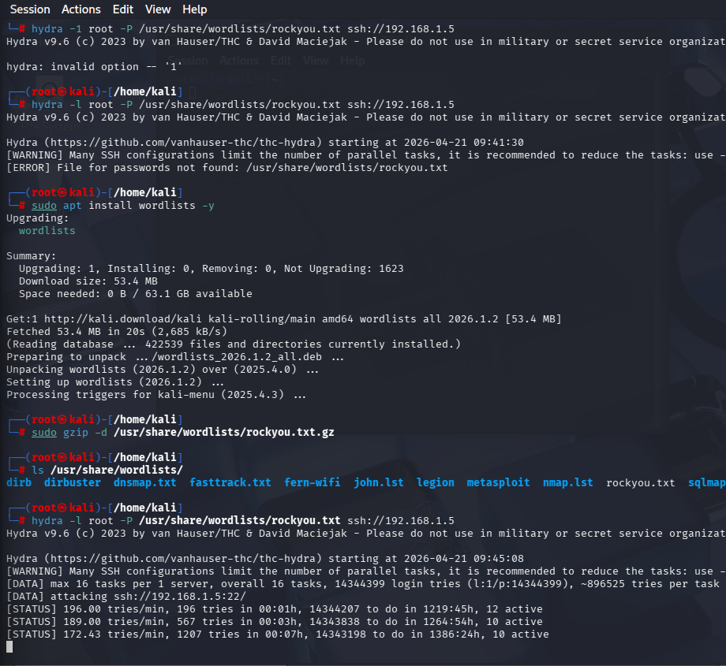
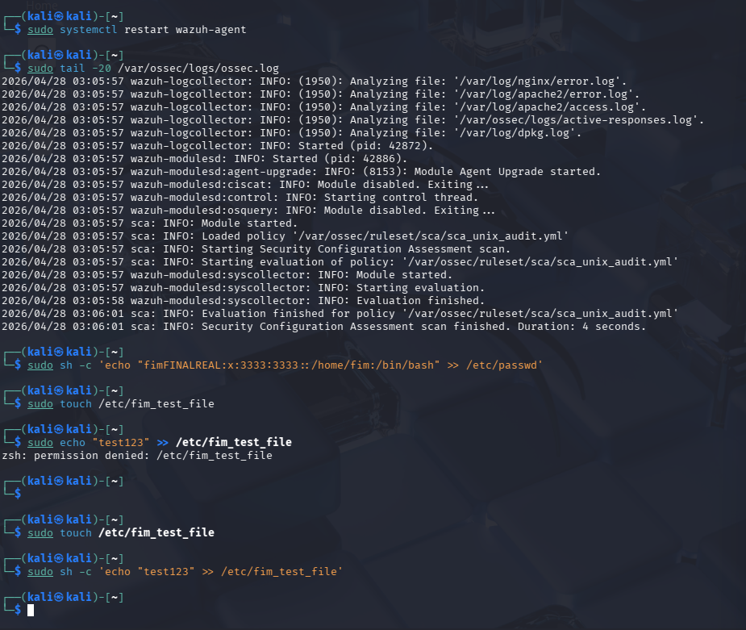
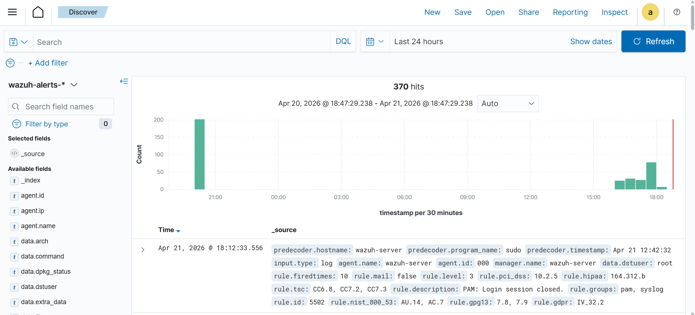
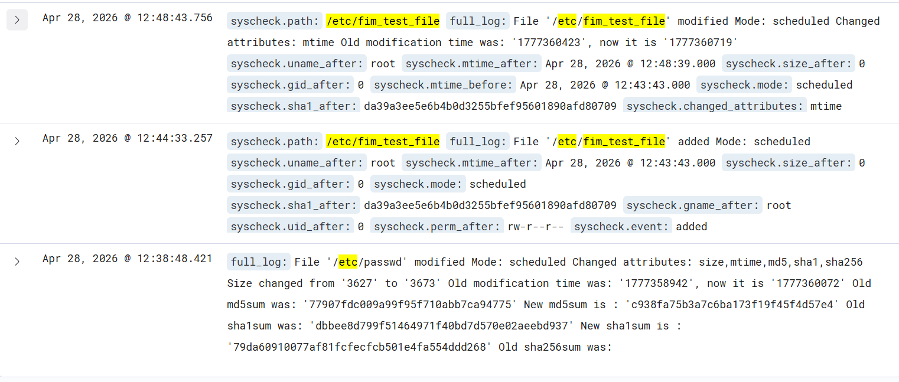
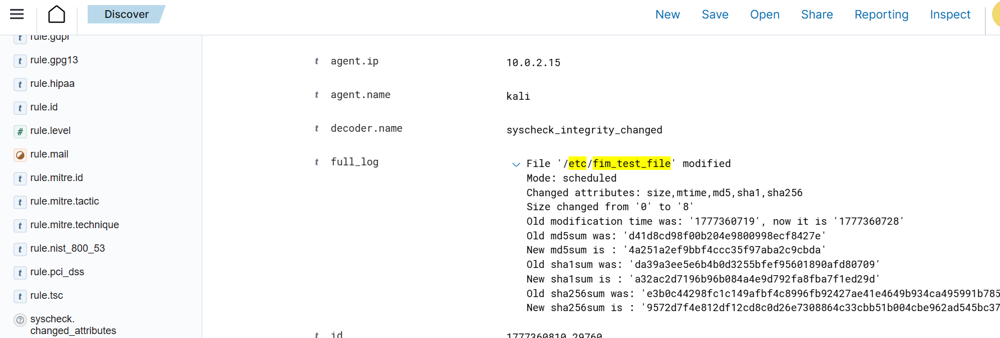

# Wazuh SOC Lab – Attack Detection & File Integrity Monitoring

SOC lab using Wazuh SIEM to detect SSH brute-force attacks and file integrity changes.

---

## 📌 Project Overview

This project demonstrates a self-built Security Operations Center (SOC) lab using Wazuh SIEM.
The objective was to simulate real-world attack scenarios and analyze how they are detected using log monitoring and File Integrity Monitoring (FIM).

The lab includes:

* Simulating an SSH brute-force attack using Hydra
* Monitoring system logs through a Wazuh agent
* Detecting unauthorized file modifications
* Analyzing alerts in the Wazuh dashboard

This project focuses on practical attack detection and analysis rather than just tool installation.

---

## 🏗️ Lab Architecture

The lab consists of a simple SOC setup where an endpoint is monitored using a SIEM system.

Kali Linux is used both as an attacker machine and as a monitored endpoint with the Wazuh agent installed.
The agent collects logs and file integrity events and forwards them to the Wazuh manager.

The Wazuh manager processes incoming data, applies detection rules, and generates alerts, which are then visualized in the Wazuh dashboard.

### Architecture Flow

```
[Kali Linux - Attacker]
   - SSH brute-force (Hydra)
   - File modification (/etc/passwd, test files)

        ↓

[Wazuh Agent - Installed on Kali]
   - Log collection
   - File Integrity Monitoring (FIM)

        ↓

[Wazuh Manager - Server]
   - Rule-based detection
   - Event correlation

        ↓

[Wazuh Dashboard]
   - Alert visualization
   - Log analysis
```

---

## 🖥️ Lab Setup

The lab was built using virtual machines:

* **Wazuh Server VM**

  * Runs Wazuh manager, indexer, and dashboard

* **Kali Linux VM**

  * Used for attack simulation and as a monitored endpoint

Both machines were connected using a bridged network to allow direct communication.

---

## ⚔️ Attack Simulation

To test the detection capabilities of Wazuh, multiple attack scenarios were simulated on the monitored system.

### 🔐 1. SSH Brute-Force Attack

A brute-force attack was performed using Hydra against the SSH service running on the target machine.

```bash
hydra -l root -P rockyou.txt ssh://<192.168.1.8>
```

This attack generates multiple failed login attempts, which are captured by the Wazuh agent and forwarded to the manager for analysis.



---

### 📁 2. File Integrity Monitoring (FIM) Test

To simulate unauthorized changes, critical system files and test files were modified.

```bash
sudo sh -c 'echo "malicious_entry" >> /etc/passwd'
```

A test file was also created and modified:

```bash
sudo touch /etc/fim_test_file
sudo sh -c 'echo "test123" >> /etc/fim_test_file'
```

These changes were monitored by Wazuh’s File Integrity Monitoring (syscheck) module.



---

## 🚨 Detection & Analysis

After simulating the attacks, Wazuh successfully detected and logged the malicious activities.

---

### 🔐 1. SSH Brute-Force Detection

The brute-force attack generated multiple failed login attempts, which were captured by the Wazuh agent.

These events appeared in the Wazuh dashboard as repeated authentication failures, indicating a potential brute-force attack.

Key indicators observed:

* Multiple failed SSH login attempts
* Repeated access attempts from the same IP
* Authentication failure logs (`sshd`, `pam`)

```md

```

---

### 📁 2. File Integrity Monitoring (FIM) Detection

Wazuh’s syscheck module detected changes made to monitored files.

The following events were observed:

* Creation of a new file (`/etc/fim_test_file`)
* Modification of the test file
* Modification of a critical system file (`/etc/passwd`)

Wazuh recorded detailed information about these changes, including:

* File path
* Timestamp (mtime)
* File size changes
* Cryptographic hashes (MD5, SHA1, SHA256)

```md

```

---

### 🔍 Event Analysis

Detailed inspection of the alerts shows how Wazuh tracks file integrity.

For each modified file, the system records:

* Previous vs updated hash values
* Metadata changes (size, permissions, timestamps)

This allows detection of unauthorized modifications and helps identify potential system compromise.

```md

```

---

## 📊 Conclusion

This project demonstrates how a SIEM solution like Wazuh can be used to detect real-world attack scenarios in a controlled lab environment.

Through this lab, I was able to simulate attacks, monitor system activity, and analyze how security events are detected and logged.

The project highlights the importance of:

* Continuous monitoring of system logs
* Detecting brute-force attacks through authentication failures
* Identifying unauthorized file changes using File Integrity Monitoring (FIM)

---

## 🧠 Skills Gained

* Understanding of SIEM concepts and SOC workflows
* Hands-on experience with Wazuh (agent, manager, dashboard)
* Log analysis and threat detection
* File Integrity Monitoring (FIM) and hash-based detection
* Basic incident analysis and investigation

---

## 🚀 Future Improvements

* Integrating additional log sources (e.g., web server logs)
* Automating alert responses
* Expanding detection rules for more attack scenarios

---
